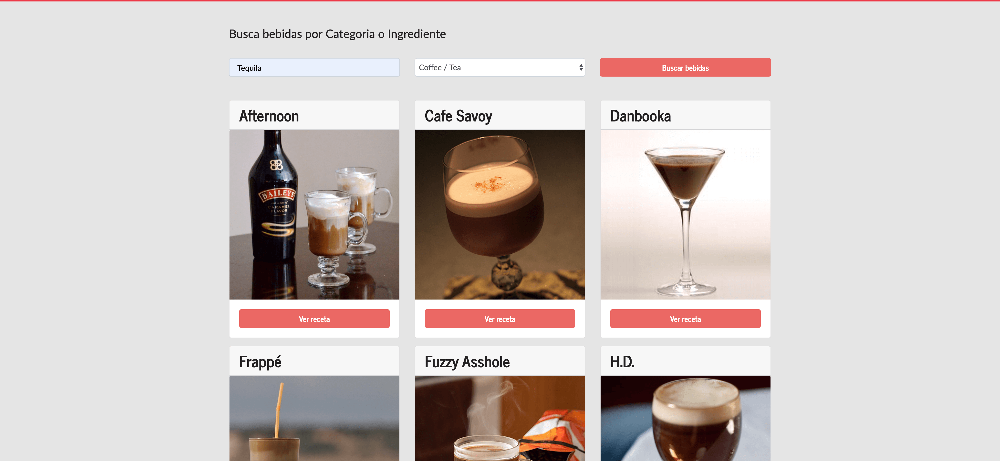

# App de busqueda de bebidas

Esta es una aplicacion creada con create-react-app para la busqueda de bebidas

[ver la aplicación](https://searchdrinks.netlify.app/)

## Cómo funciona?

Requiere nodeJs

- `npm install` para instalar las dependencias.
- `npm run start` para el entorno de desarrollo.
- `npm run build` para el entorno de producción.

## Licencia

MIT
